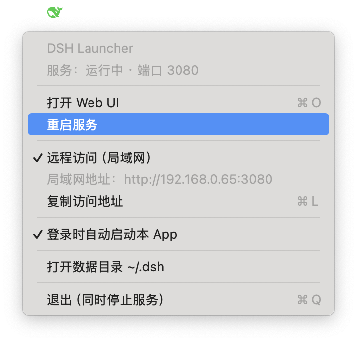

# DSH Launcher — DeepSeek Harness 菜单栏 App

[English](README.en.md) | **中文**

macOS 菜单栏小应用：把 `dsh web` 服务交给 launchd 托管，**不再需要开着终端**。
**App 在 → 服务就在：启动 App 自动拉起服务，退出 App 自动停止服务。**
点击菜单栏鲸鱼图标（🐋 绿=运行中 / 橙=端口被外部占用 / 红=启动失败 / 灰=未运行，图标为官方 dsh 鲸鱼 logo 按状态着色）弹出控制菜单，可打开 Web UI、重启服务、设置登录自启、打开数据目录或退出。
> 绿色 = launchd 托管进程在运行 **且** HTTP 3080 实际可访问，双条件缺一不亮绿。
服务进程继承你终端的 zsh 环境（PATH 等），agent 的 shell 工具直接可用 node/npm/pnpm/bun 等工具链。



## 需要先手动执行 `npx @deepseek-ai/dsh web` 吗？

**不需要。** 前提只是"机器上装有 Node.js"：

- 本 App 负责启动并托管 `dsh web --port 3080`（App 启动自动拉起，也可点"重启服务"手动拉起）；已有 dsh（全局安装或 npx 缓存）直接复用。
- 首次使用（本地无 dsh）时，App 不会自动下载，菜单栏显示"服务：dsh 未安装"并出现「安装 dsh」按钮。点击后弹出安装面板（实时显示下载日志），安装完成自动拉起服务，全程无需重启 App。
- 如果你之前在终端手动跑过 `dsh web`，那个进程占着 3080 端口，App 会显示橙色"外部实例"——先在终端按 `Ctrl+C` 停掉，再让 App 接管（步骤见下文）。

## 安装（DMG 发行版）

从 [Releases](https://github.com/tttnny/DSH-Launcher/releases) 下载 `DSH-Launcher-*.dmg`：

1. 打开 DMG，把 `DSH Launcher.app` 拖进 **Applications**
2. 首次打开（未签名/未公证，Gatekeeper 会拦截）：Finder 里右键 `DSH Launcher.app` → **打开**；或执行
   ```bash
   xattr -dr com.apple.quarantine /Applications/DSH\ Launcher.app
   ```

要求：Apple Silicon Mac（M1/M2/M3/M4）· macOS 13 或更高 · 装有 Node.js（fnm / nvm / Homebrew 均可）。

## 构建

```bash
./build.sh        # 产出 dist/DSH Launcher.app（ad-hoc 签名，无需开发者账号）
```

产物为可直接运行的 `dist/DSH Launcher.app`，拷贝到任意位置（如 `~/Applications/`）即可使用。

## 菜单功能

| 菜单项 | 作用 |
|---|---|
| 状态行 | 服务是否运行（launchd 托管 / 外部实例占用 3080） |
| 打开 Web UI (⌘O) | 浏览器打开 http://127.0.0.1:3080 |
| 安装 dsh（仅未安装时显示） | 首次使用点击安装，弹窗实时显示下载进度，装完自动启动服务 |
| 重启服务 | 永远可用：运行中=重启；启动失败/未运行=直接启动；端口被外部实例占用=弹窗说明占用者 |
| 更新 dsh / 检查更新 | 自动检测 npm 新版本（启动 10 秒后及每 6 小时各查一次，静默不弹窗）：发现新版本时菜单变为「更新 dsh → vX」，点击一键升级（`npm install -g @deepseek-ai/dsh@latest`），完成后自动重启服务；无更新时点此手动检查 |
| dsh 版本：vX | 只读信息行，显示当前已安装的 dsh 版本（未安装时显示「未安装」） |
| 登录时自动启动本 App | 登录后自动出现菜单栏图标并拉起服务 |
| 打开数据目录 | `~/.dsh` |
| 退出 | 退出 App **并停止服务**（`launchctl bootout`，数据已落盘，下次打开 App 即恢复） |

## 从终端实例切换（第一次使用）

现在端口 3080 可能还被终端里的 `dsh web` 占着（App 会显示橙色"外部实例"）。
切换步骤：

1. 在终端按 `Ctrl+C` 停掉旧的 `dsh web`（本次会话会离线，但历史记录都在 `~/.dsh/sessions/`）
2. 退出再打开 DSH Launcher（或点 **重启服务**），服务自动拉起
3. 状态变绿后点 **打开 Web UI**，历史会话完整可续

## 技术要点

- **环境继承**：launchd 本身没有你的 shell 配置，所以每次启动服务前，App 会用
  `zsh -lic` 抓取你的完整环境写入 plist 的 `EnvironmentVariables`（PATH 剔除易失的
  fnm multishell 临时目录、node 目录置顶）。服务进程与 agent 的 shell 工具因此
  直接可用终端同款工具链（node/npm/pnpm/bun 等），改 `.zshrc` 后重启服务即生效。
- **升级 dsh 无需改配置**：每次启动服务都会重新解析 node 与最新 dsh 包路径并
  重写 `~/Library/LaunchAgents/com.dsh.web.plist`。
- **自动更新检测**：App 启动 10 秒后及每 6 小时查询一次 npm registry
  （`@deepseek-ai/dsh` 的 latest 版本），与本地已装版本对比；发现新版本时菜单栏出现
  「更新 dsh → vX」并弹窗提示，一键执行 `npm install -g @deepseek-ai/dsh@latest`，
  完成后自动重启服务加载新版。更新日志：`~/Library/Logs/DSHLauncher/dsh-update.log`。
- **日志**：`~/Library/Logs/DSHLauncher/dsh-web.log`。

## 卸载

```bash
launchctl bootout gui/$(id -u)/com.dsh.web 2>/dev/null
launchctl bootout gui/$(id -u)/com.dsh.menubar 2>/dev/null
rm -f ~/Library/LaunchAgents/com.dsh.web.plist ~/Library/LaunchAgents/com.dsh.menubar.plist
rm -rf ~/Applications/DSH\ Launcher.app
```
